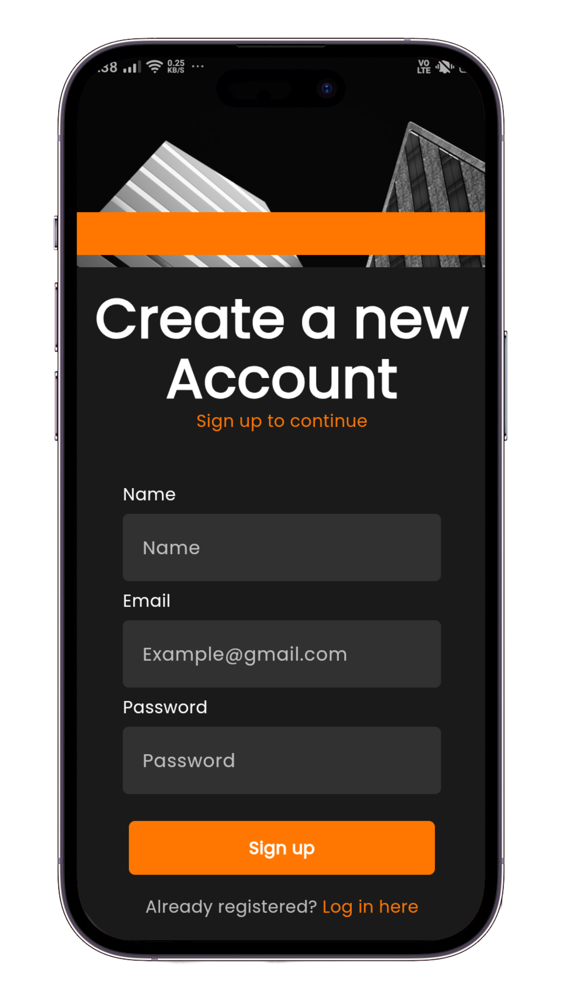
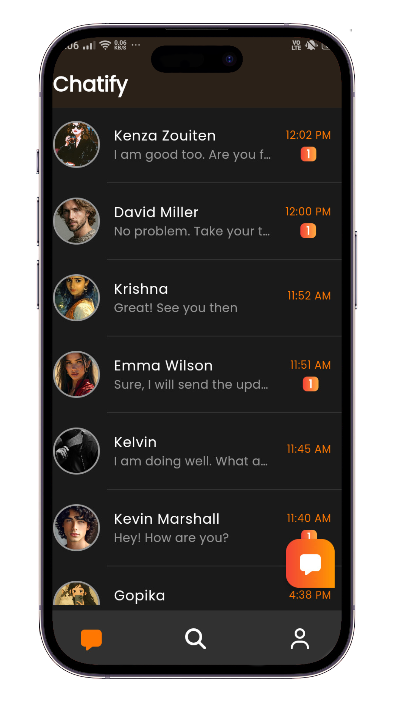
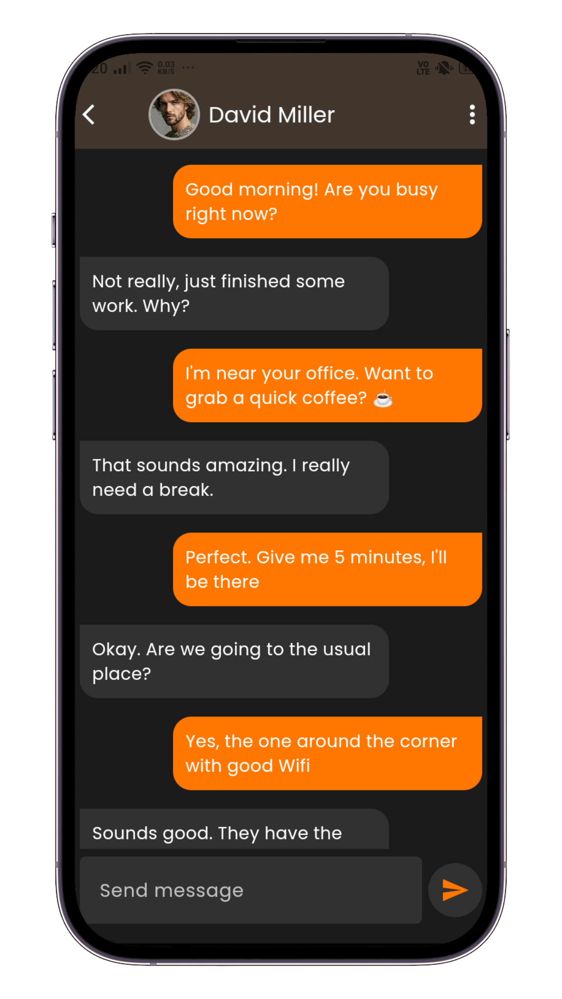
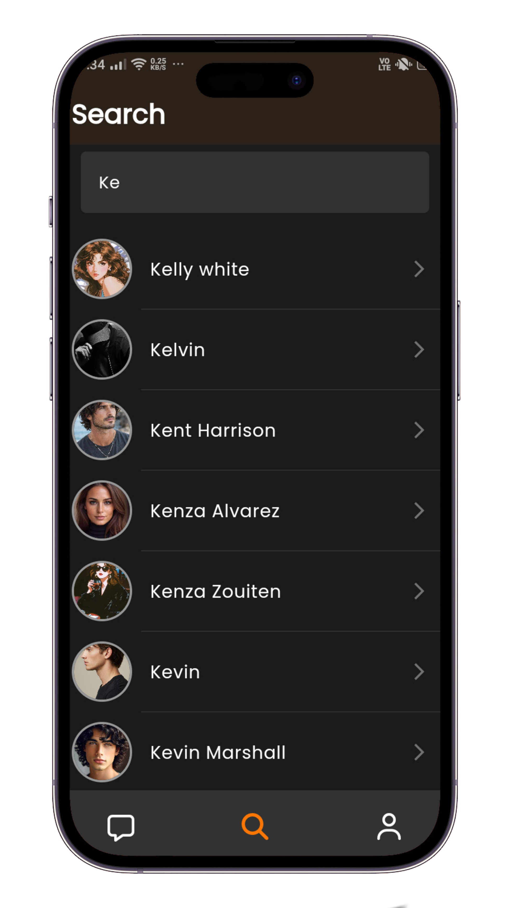
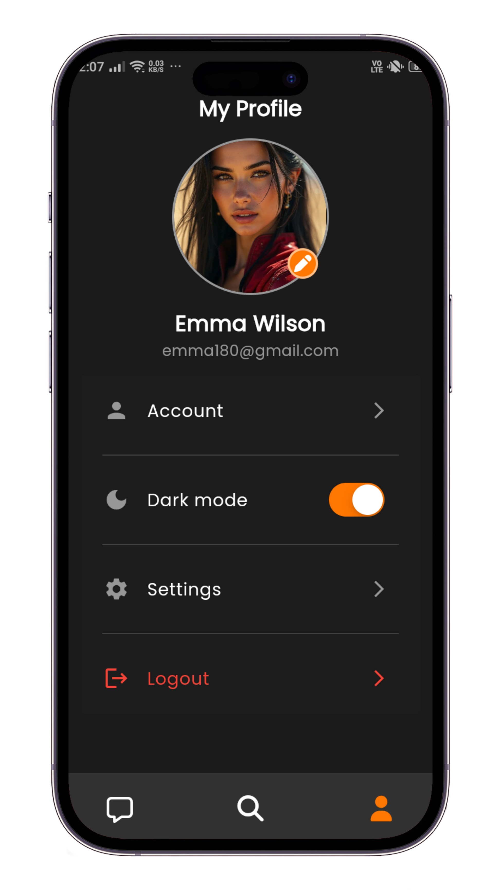

## 💬 Real-Time Chat Application

A modern real-time chat application built with Flutter.
Users can send private messages, search users, manage profiles, block/unblock users, and interact in a smooth real-time chat environment.
The app uses Firebase and Supabase for authentication, database, and media storage.

## 📸 Screenshots

  <table>
    <tr>
      <td align="center"> <b>Register Page</b></td>
      <td align="center"> <b>Real-Time Chats</b></td>
      <td align="center"> <b>Real-Time Messaging</b></td>
    </tr>
    <tr>
      <td align="center"> <b>Search Users</b></td>
      <td align="center"> <b>Profile Page</b></td>
      <td></td>
    </tr>
  </table>

## 🚀 Features

- 🔐 Secure Authentication using Firebase Auth
- 💬 Real-time one-to-one private messaging
- 📨 Real-time message streaming using Cloud Firestore
- 👀 Seen status and unread message counter
- 🗑 Swipe-to-delete chats with per-user visibility handling
- 🚫 Block and unblock users
- 📋 View blocked users list
- 🔍 Search users efficiently with debounced search
- 👤 User profile management
- ✏ Change profile name
- 🖼 Upload/change/delete profile images using Supabase Storage
- 🗑 Secure account deletion with re-authentication
- 🌗 Light and Dark theme support
- ⚙ State management using flutter_bloc
- 🧱 Clean Architecture with feature-first folder structure

## 🛠 Tech Used

- Flutter
- Dart
- flutter_bloc
- Firebase Authentication
- Cloud Firestore
- Supabase Storage
- Google Fonts
- cached_network_image
- flutter_slidable
- lottie

## 🏗 Architecture

This project follows a feature-first layered architecture:

- Clear separation of Presentation, Domain, and Data layers
- Feature-based modular structure
- Repository pattern implementation
- Scalable and maintainable codebase
- Predictable state management using BLoC

Main feature folders:

- auth
- chat
- message
- users
- block
- search
- profile
- theme

## 🔥 Backend Usage

- Firebase → Authentication & real-time database
- Supabase Storage → Profile image storage

## 📱 Supported Platforms

- Android
- iOS
- Web

## 👨‍💻 Developer

Author: Anandu Udayan  
Email: anandu.dev180@gmail.com
